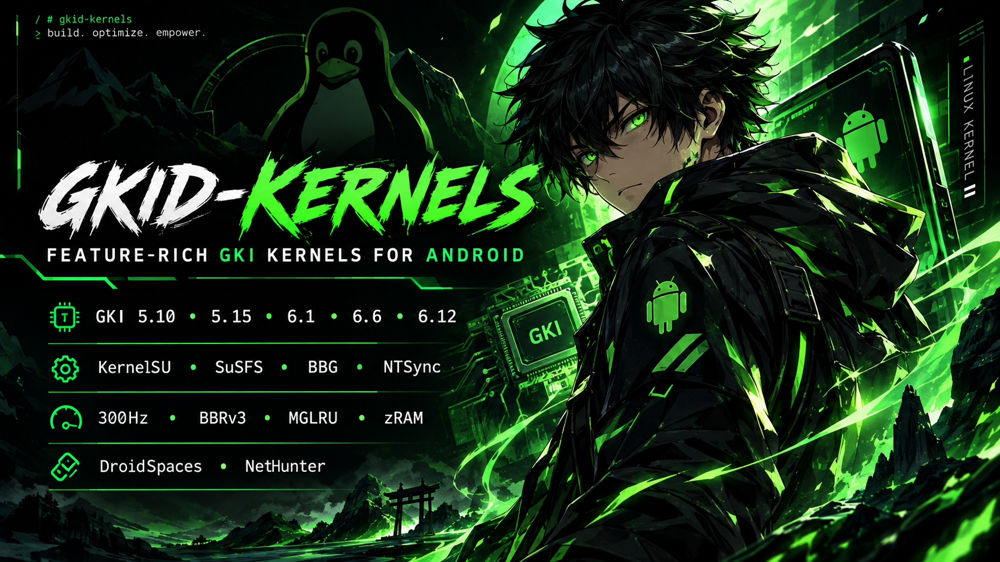

# GKID Kernel

  

Un kernel de Imagen de Kernel Genérico (GKI) con múltiples características, construido para el **Poco X6 Pro (Duchamp)** y compatible con cualquier dispositivo que ejecute un kernel GKI **6.1.xx-android14**. Diseñado para ofrecer una flexibilidad máxima, proporciona múltiples variantes para adaptarse a tus necesidades específicas, ya sea que priorices la gestión de root, la integridad del sistema o el rendimiento.

## ✨ Características Principales

*   **⚡ Ajustes de Rendimiento y Eficiencia:** Optimizado extensivamente para el Poco X6 Pro (y dispositivos similares 6.1.xx-android14):

    - Frecuencia del temporizador configurada a **300Hz** para una latencia de entrada notablemente menor y una sensación más ágil
    - **Multi-Gen LRU (MGLRU)** habilitado para un mejor multitarea y eficiencia de batería
    - **Operaciones de memoria optimizadas** (memcpy, memcmp, memset) desde ARM-optimized-routines para un manejo de cadenas/memoria hasta un 50 % más rápido
    - **Raíz cuadrada entera 3x más rápida** que reduce el tiempo de CPU en cálculos de cpufreq
    - **zRAM** optimizado con compresión LZ4 + writeback + tracking para tener más RAM utilizable y más rápida bajo cargas pesadas
    - Gobernadores de CPU: **schedutil + ondemand** para un escalado eficiente pero receptivo
    - **Programador E/S mq-deadline** ajustado para baja latencia en almacenamiento UFS 4.0
    - Pila de red con **TCP BBRv3** + **TCP Westwood+** + **FQ** + **ECN** + **soporte IPv6 HL** + **TCP_NODELAY forzado** para reducir la latencia y aumentar la velocidad de WiFi/datos móviles
    - Ajustes del sistema de archivos **F2FS** (sueño de GC reducido a 50ms, bloques fsync ampliados, tiempo de espera de congestión reducido)
    - Edad de confirmación de **ext4** extendida a 30s para reducir las escrituras en disco
    - Soporte completo de **IP Set** + **IPv6 NAT** para mejor rendimiento de tethering y VPN
    - **Corrección de Unicode del sistema de archivos** que previene cierres inesperados por nombres de archivo UTF-8 no válidos en vfat/exfat
    - **Controlador NTSync** para juegos/apps de Windows significativamente más rápidos en Winlator & GameHub

*   **🔋 Optimizaciones de Batería y Energía:**
    - Tiempo de espera de congelación reducido de 20s a **1s** para una detección más rápida de interbloqueos
    - Tiempo de espera global de wakelock limitado a **500ms** para evitar un drenaje infinito de la batería
    - Despertar de Alarmtimer minimizado usando valores reales de temporizador en lugar de 2s codificados
    - Intentos excesivos de despertar s2idle eliminados (despertar único en lugar de múltiples)
    - Intervalo de verificación PCI PME extendido para reducir despertares innecesarios
    - Presión de caché VFS reducida a **50** para un mejor uso de la RAM
    - Cache hot buddy deshabilitado para la eficiencia de la Unidad Compartida DynamIQ

*   **🧠 Optimizaciones del Programador y CPU:**
    - Orden de escaneo de CPU ajustado para una selección eficiente de núcleos inactivos
    - Pistas de predicción de rama optimizadas en rutas de cpufreq
    - Estructura de archivo alineada a 8 bytes para un mejor rendimiento de caché
    - Página clara alineada a 16 bytes reduciendo el tiempo de CPU en la asignación de páginas
    - Optimizaciones de prefetch de memoria para operaciones de copia

*   **🐉 Kali NetHunter:** Soporte completo habilitado (modo monitor, inyección de paquetes, controlador rtw88). Se proporcionan módulos **WirelessKSU** correspondientes para cada variante.

*   **🐳 DroidSpaces:** Soporte completo a nivel de kernel habilitado para [DroidSpaces](https://github.com/ravindu644/Droidspaces-OSS), un runtime de contenedores liviano que te permite ejecutar distribuciones Linux reales (Ubuntu, Debian, etc.) con aislamiento adecuado y sistemas init (systemd/OpenRC) directamente en tu dispositivo Android.

*   **🔧 Múltiples Variantes:** Elige la configuración que se adapte a tus necesidades:
    - **Soluciones de Root:** KernelSU, KernelSU Next, SukiSU Ultra, ReSukiSU o Vanilla (sin root)
    - **Flexibilidad de Gestor:** Las variantes Multiple-Manager te permiten usar la app de gestor que prefieras
    - **Opciones LTO:** compilaciones thinLTO + variantes dedicadas `+NoLTO` / `Compat+NoLTO`

*   **🛡️ Integración SUSFS:** Capacidades avanzadas de ocultación y spoofing a nivel de kernel (disponible en variantes dedicadas)
*   **🔒 Baseband Guard (BBG):** LSM ligero que bloquea escrituras no autorizadas en particiones críticas y nodos de dispositivo, protegiendo la baseband y la cadena de arranque de manipulaciones

## ⭐ Apoya el Desarrollo

Si encuentras este kernel útil, considera mostrar tu apoyo:

*   **Ponle una Estrella al Repositorio:** Dale un ⭐ a este proyecto en GitHub para ayudar a otros a descubrirlo
*   **Comparte:** Difunde la información en tu comunidad, foros o con otros usuarios del Poco X6 Pro
*   **Reporta Problemas:** ¿Encontraste un error? Abre un issue con registros detallados para ayudar a mejorar la estabilidad
*   **Contribuye:** Las pull requests, sugerencias y comentarios constructivos son siempre bienvenidos

Tu apoyo ayuda a mantener y mejorar este proyecto para todos.

## 🧩 Módulos Recomendados para Poco X6 Pro

Mejora tu dispositivo con estos módulos complementarios:

| Módulo | Descripción |
|--------|-------------|
| [**GPU Unlocker** (Solo HyperOS)](https://github.com/ahmed-alnassif/GPU-Unlocker) | Desbloquea la GPU Mali-G615 MC6 de 701 MHz a 1.4 GHz completos en POCO X6 Pro HyperOS. |
| [**Thermal Manager** (Solo AOSP)](https://github.com/ahmed-alnassif/Thermal-Manager) | Corrige el problema de reinicio del modo/perfil térmico en Poco X6 Pro. Monitorea y fuerza la persistencia de tu modo elegido: **Equilibrado** ⚖️, **Ahorro de Batería** 🔋, **Rendimiento** ⚡ o **Juegos** 🎮. Incluye **WebUI** para cambio instantáneo, ahorro de batería automático cuando la pantalla está apagada y persistencia del modo tras reiniciar. |
| [**DSP AudioFix** (Solo AOSP)](https://github.com/ahmed-alnassif/DSP-AudioFix) | Solución simple para audio distorsionado en Poco X6 Pro y dispositivos Xiaomi/MediaTek similares con amplificadores inteligentes Awinic. |

>[!TIP]
>Ambos módulos están diseñados específicamente para las peculiaridades de hardware del Poco X6 Pro y funcionan sin problemas con cualquier variante del kernel GKID.

## 📱 Compatibilidad
*   **Dispositivo Principal:** Poco X6 Pro (nombre en código `duchamp`)

*   **Requisito GKI:** Se instala en cualquier dispositivo con un kernel **6.1.xx-android14**.  
    *(Nota: Solo probado en el Poco X6 Pro. Por favor, ten precaución con otros dispositivos.)*

## ⬇️ Descargas
Encuentra las compilaciones más recientes para todas las variantes en la sección [Releases](https://github.com/ahmed-alnassif/GKI-Duchamp/releases).

## 🐧 Código Fuente del Kernel
**GitHub:** [ahmed-alnassif/GKI-Duchamp-6.1](https://github.com/ahmed-alnassif/GKI-Duchamp-6.1)
